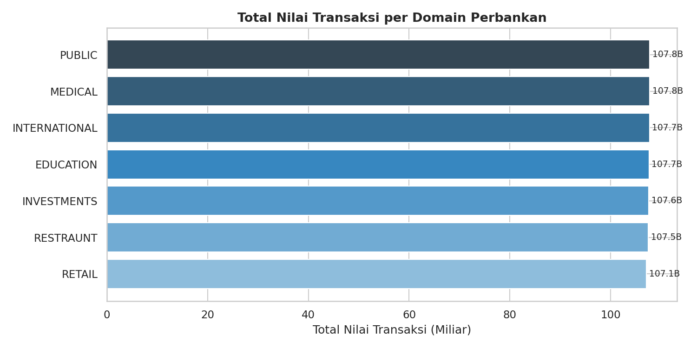
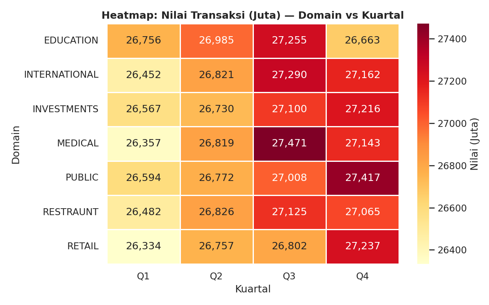

# Big Data Analysis — Bank Transaction Dataset (1M Rows)

Analisis transaksi perbankan India berskala besar menggunakan Apache Spark (PySpark) di Google Colab.

## Dataset
- Sumber: [Kaggle — Massive Bank Dataset](https://www.kaggle.com/datasets/ksabishek/massive-bank-dataset-1-million-rows)
- Jumlah baris: ±1.000.000
- Domain: Investments, International, Retail, Restaurant, Medical, Public, Education

## Tools
- PySpark (Apache Spark 3.x)
- Pandas, Matplotlib, Seaborn
- Google Colab

## Key Insights
1. Domain **INVESTMENTS** mendominasi total nilai transaksi
2. Kota tier-2 (Ludhiana, Kanpur) bersaing dengan kota besar
3. Domain **INTERNATIONAL** memiliki nilai tertinggi per transaksi
4. Pola musiman berkorelasi dengan siklus fiskal India (Q1 & Q4)
5. Domain **EDUCATION** memiliki ticket size terkecil

## Visualisasi

## Cara Jalankan
1. Buka file `.ipynb` di Google Colab
2. Upload `bankdataset.xlsx` dari Kaggle saat diminta
3. Jalankan cell satu per satu dari atas
